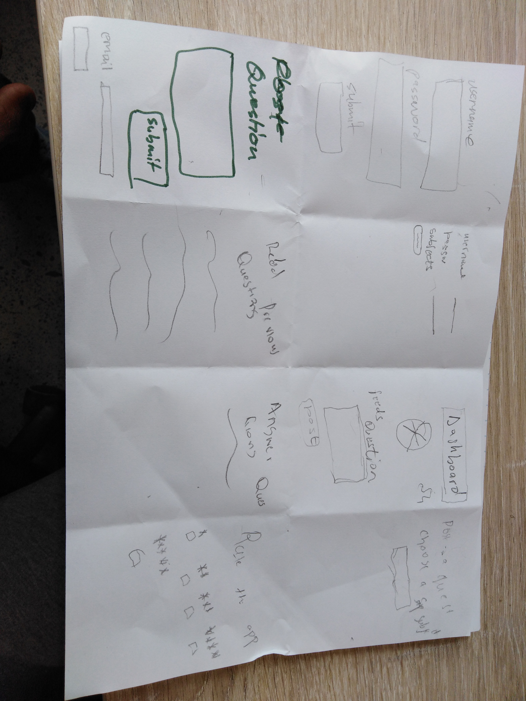

# Sparklight-hackathon

We are building a community application for high school students where they can engage by posting questions that they have on a specific subject (i.e mathematics),
Whoever(student / teacher) has answers can reply by answering the question.

we are making a community whereby no student is left behind , whether they have a question or concept they don't under
stand.

Our app provides a platform for students who are uncertain about certain topics of their selected subject(s). The student gets the opportuinity to engage with the community of the
app, by asking assistance and whoever has a solution to their query will provide it to them.

The common factors that the people involved share is that both student and teachers can ask questions and provide answers. The difference between those that are involved is the 
teachers are qualified and the students are still in the learning process. 

A student needs to be able to identitfy the problem that they are struggling with. The teacher should be qualified on that subject that the student has an issue with in order to 
assist the student.

Gaining better understanding on the subject.

 
| Image       | description   |
|-------------|---------------|

